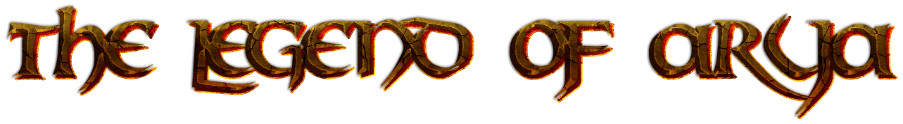
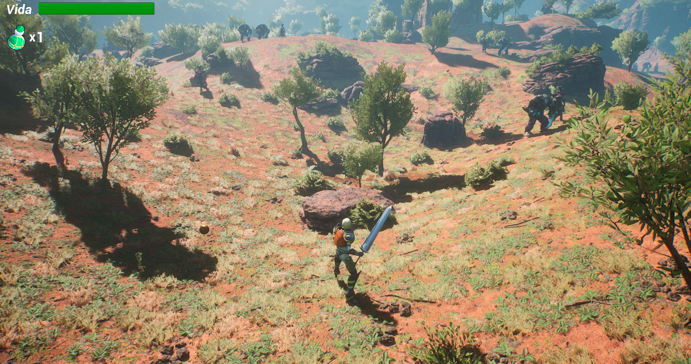

<section align="center">

Este juego del genero RPG, cuenta con un mundo lleno de enemigos y un jefe final, ademas de recolectables 
de pociones para nuestro jugador

-Controles-

El control se realizara a través de teclado y ratón, con los botones W,S,A,D podremos movernos hacia delante, detrás, izquierda, derecha caminando, si queremos correr, simultáneamente a estos debemos tener pulsado el botón de shift izquierdo (↑). 
Con el click izquierdo del ratón realizamos el ataque1 con la espada, y con el derecho el ataque2 la patada. 
Con el botón Q nos tomamos una poción si tenemos disponibles. 
Y con el movimiento del ratón podemos mover la cámara del personaje. 

-Enemigos-

Bruja-> Es el enemigo básico, es rápida y nos empieza a perseguir enseguida cuando entramos en su área, cuenta con 100 puntos de vida y un único tipo de ataque que realiza cada 2 segundos y hace 8 puntos de daño. 

Mutante azul-> Este enemigo es mas lento, tarda más en detectarnos, pero sus ataques son más potentes y tiene más vida (200 puntos), cuenta con dos ataques que alterna: 
 	

-Ataque1 (puño) quita 15 de daño  

 	
-Ataque2 (garra) quita 5 de daño 

Además, este enemigo si lo matamos con una patada del jugador nos suelta una poción. 

Jefe final: Es el jefe del mapa, solo hay uno en el mapa, tiene una cantidad inmensa de vida (800 puntos) y cuentas con varios ataques: 
 	

-Ataque1 (manotazo): quita 25 de vida al jugador 

 	
-Ataque2 (patada): quita 60 de vida al jugador 

	
-Aturdimiento: cada 3 patadas realiza este ataque que deja al jugador inhabilitado durante 3 segundos 

-Como desplegar el juego-
</h2>

El juego esta desarrollado con el motor Unreal version 4.27.1, simplmente importando el proyecto
en el editor de Unreal y podemos inciarlo para jugar.

</section>
